# Writeup: Track 3D-Objects Over Time

Step 1: Compute Lidar Point-Cloud from Range Image
- Visualize range image channels (ID_S1_EX1): to do this we will need:
  - extract lidar data and range image 
  - extract the range and the intensity channel from the range image
  - convert range and intensity to 8 bit channel
  - stack the range and intensity image vertically
  - change the config in `loop_over_dataset.py`

  The result:  
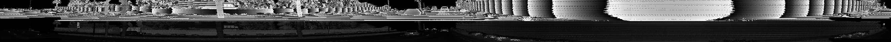
- Visualize lidar point-cloud (ID_S1_EX2)
  - Visualize lidar point-cloud using Open3D

  **Rear-bumper and tail-lights are stable features. In some specific cases, we can see car's front-lights and the wheel as the stable features**
  
  10 samples of the point cloud:

  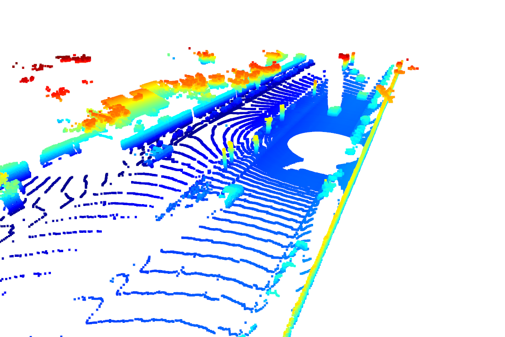

  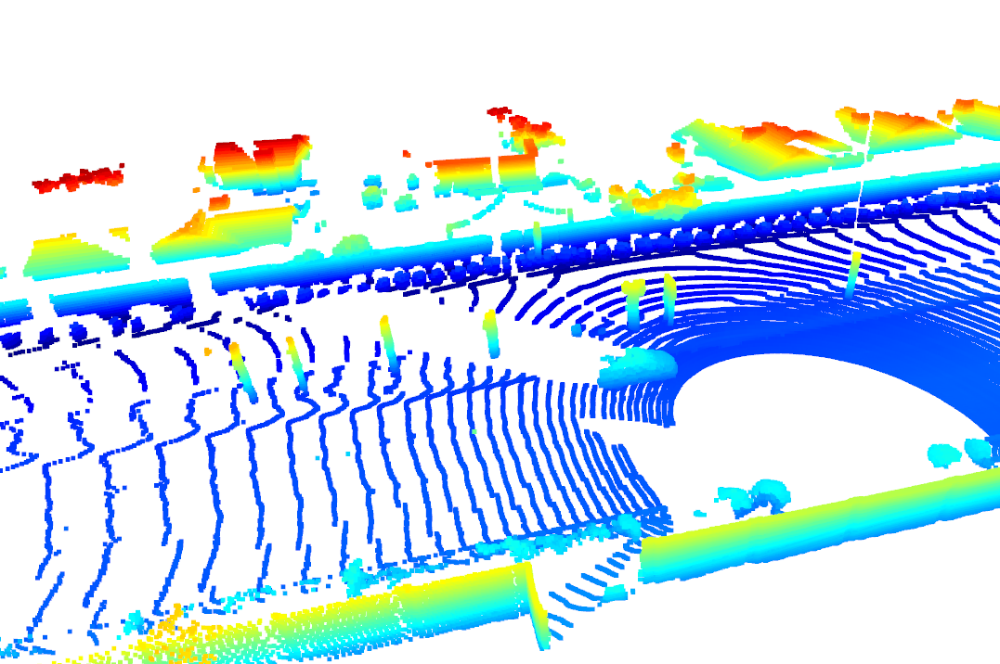

  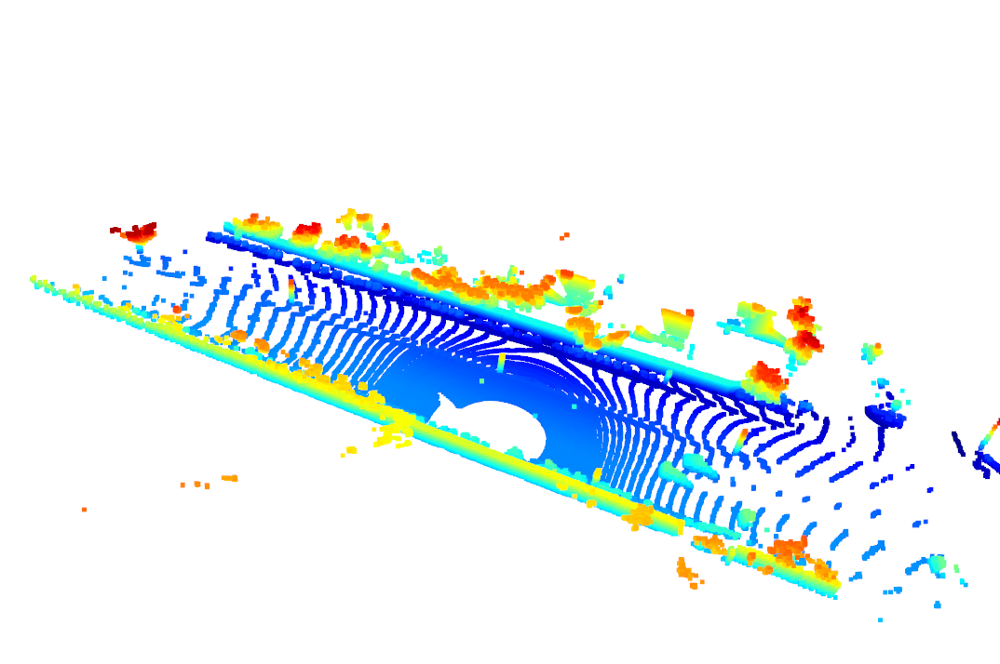

  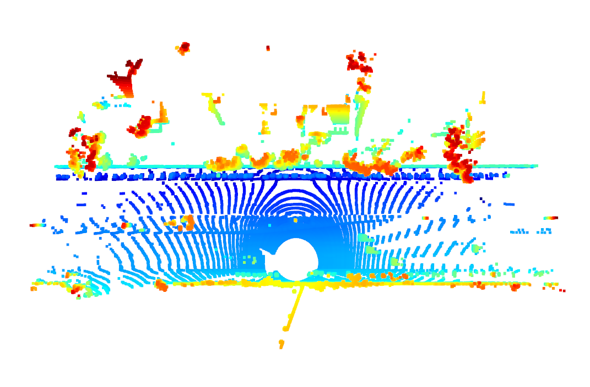

  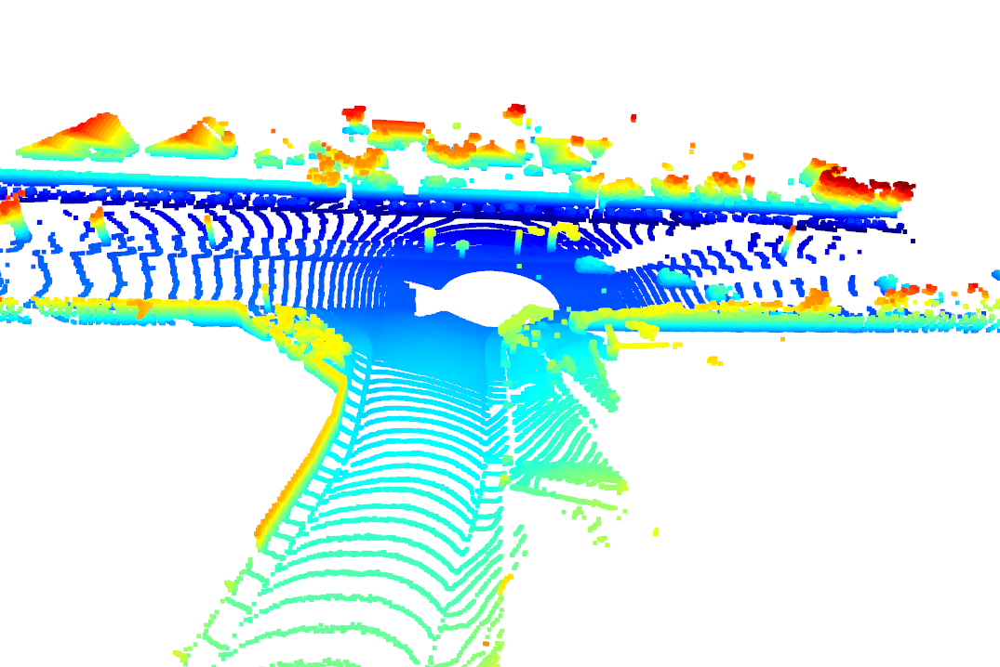

  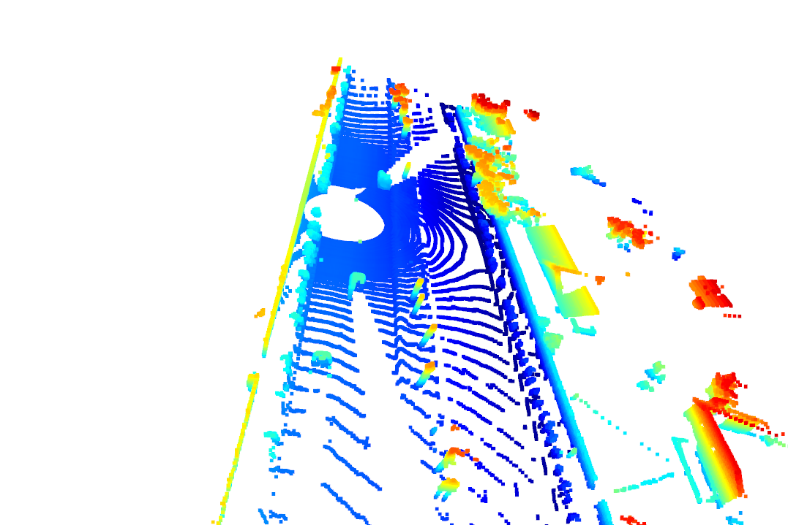

  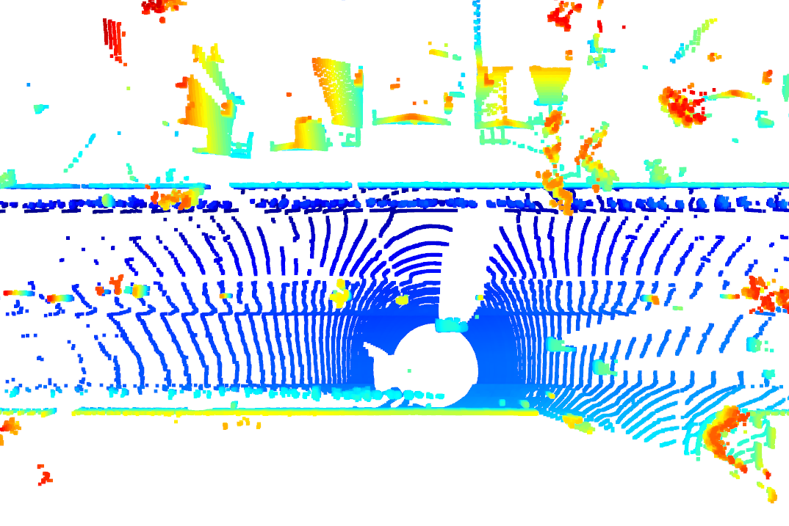

  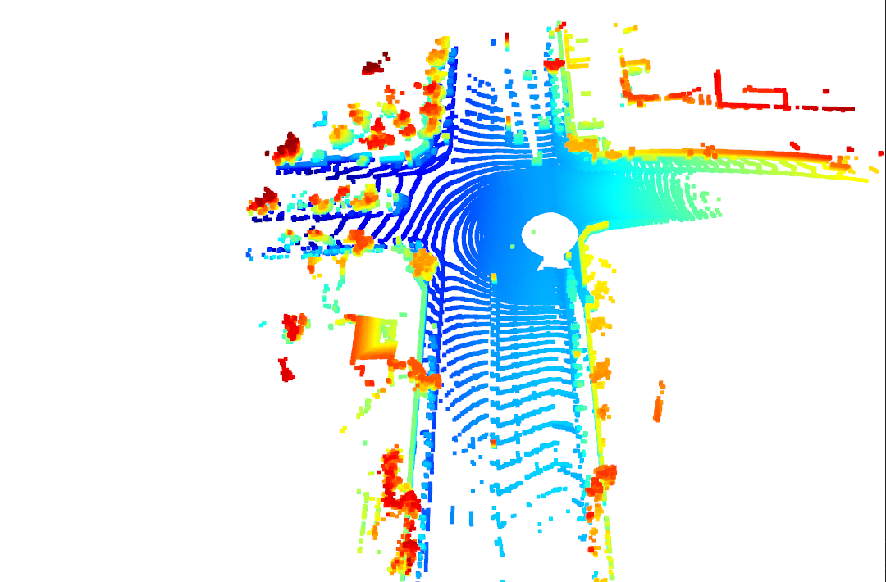

  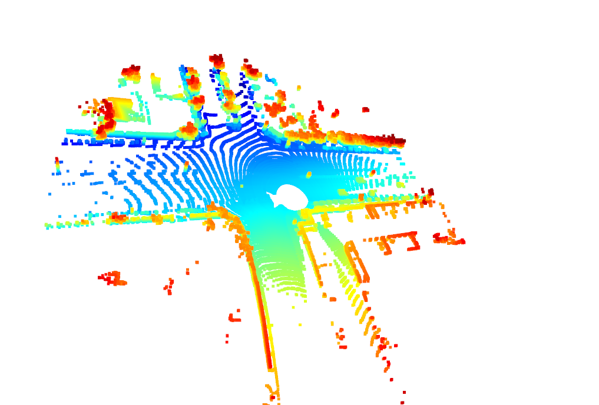

  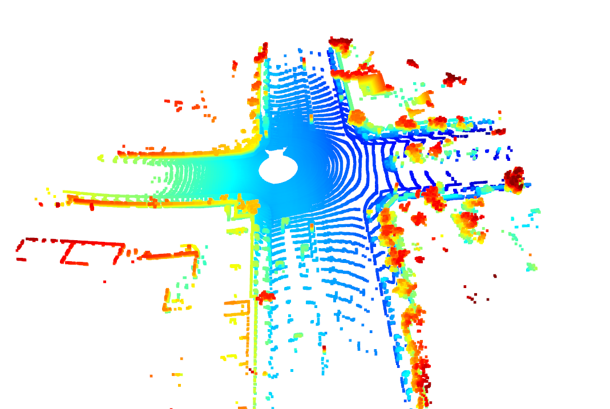

Step 2: Creaate BEV from Lidar PCL
- Convert sensor coordinates to BEV-map coordinates (ID_S2_EX1)
  - compute bev-map discretization
  - create a copy of the lidar pcl and transform all metrix x-coordinates into bev-image coordinates
  - perform the same operation as in step 2 for the y-coordinates

  BEV sample:

  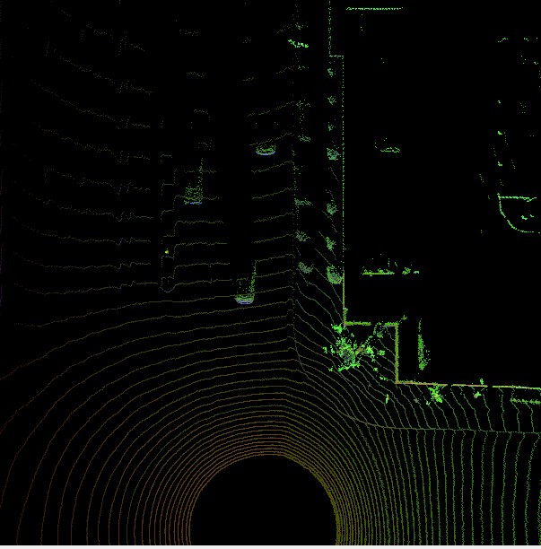

  BEV with intensity

  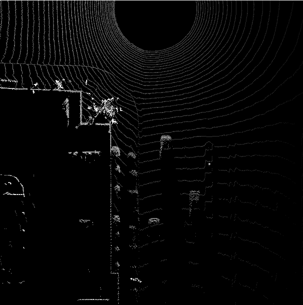

Step 3 : Model-based Object Detection in BEV Image
- Add a second model from a GitHub repo (ID_S3_EX1)
  - modify the code to load the fpn_resnet model
- Extract 3D bounding boxes from model response (ID_S3_EX2)
  - perform the conversion using the limits for x, y and z set in the configs structure for each detection

  The result:

  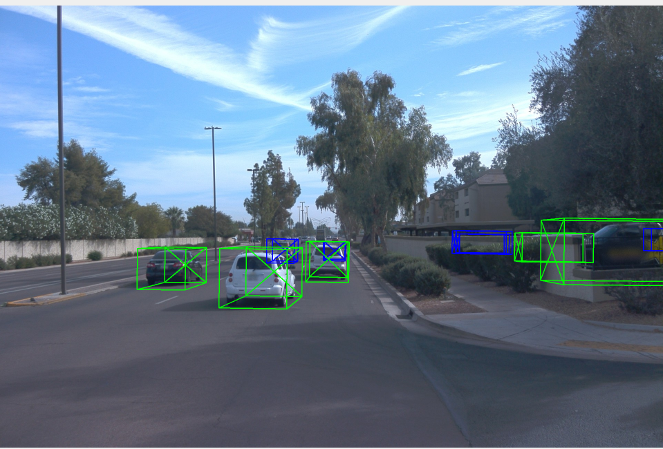

  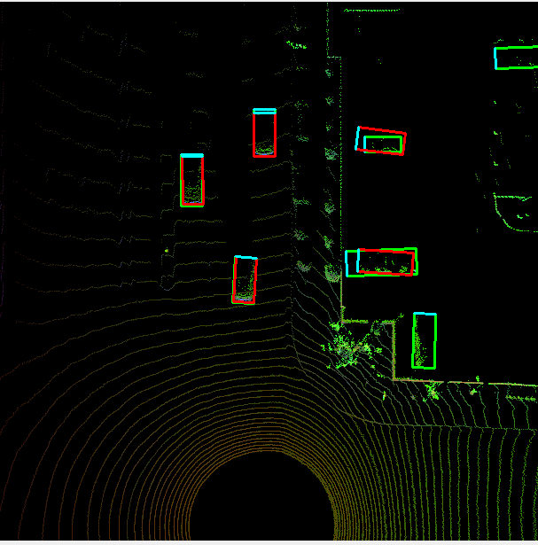

Step 4 : Performance Evaluation for Object Detection
- Compute intersection-over-union between labels and detections (ID_S4_EX1)

  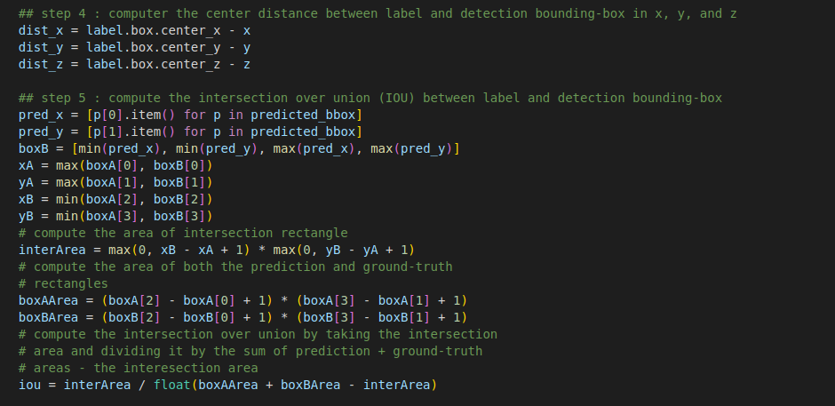
- Compute false-negatives and false-positives (ID_S4_EX2)
  
  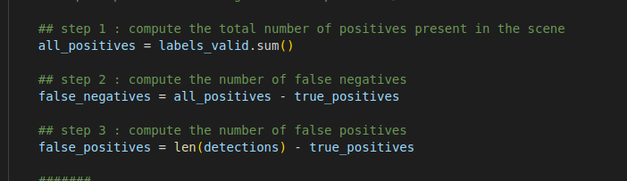
  
- Compute precision and recall (ID_S4_EX3)

  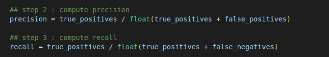

  The result

  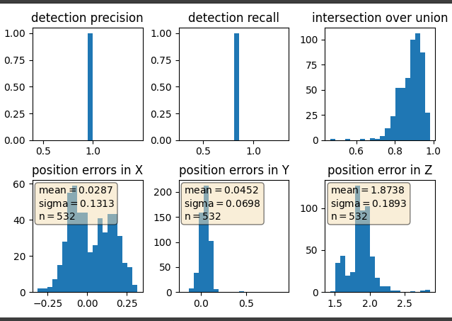
